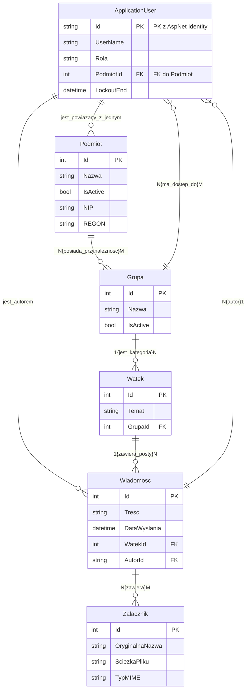

## 🧾 Spis Treści
* [Rola 1: Użytkownik Podmiotu](#rola-1)
* [Rola 2: Użytkownik UKNF (Administrator)](#rola-2)
* [Rola 3: Użytkownik UKNF (Merytoryczny)](#rola-3)
* [Wymagania Ogólnosystemowe](#opis)
* [Dokumentacja Backend](#docbackend)
* [Dokumentacja Frontend](#docfrontend)
---

  
<h3>👤 Rola 1: Użytkownik Podmiotu</h3>

  Osoba reprezentująca instytucję nadzorowaną (np. bank).

| Wymaganie (Co chcę) | Cel (Po co) |
| :--- | :--- |
| Móc zalogować się do systemu za pomocą nazwy użytkownika (lub e-maila) i hasła. | Uzyskać dostęp do skrzynki odbiorczej i nadawczej. |
| Mieć możliwość odbierania wiadomości (wraz z załącznikami) wysłanych do mnie przez UKNF. | Zapoznać się z korespondencją od nadzorcy. |
| Mieć możliwość wysyłania wiadomości (wraz z załącznikami) **tylko do UKNF**. | Móc komunikować się z urzędem. |
| Widzieć wszystkie wiadomości pogrupowane w wątki (rozmowy). | Łatwo śledzić historię konwersacji. |
| Otrzymując wiadomość wysłaną do całej grupy (np. "Banki"), nie widzieć innych adresatów. | Zachować poufność korespondencji. |
| Móc odpowiedzieć na wiadomość grupową. | Moja odpowiedź trafi do indywidualnego wątku, widocznego tylko dla mnie i UKNF. |

  
<h3>👑 Rola 2: Użytkownik UKNF (Administrator)</h3>

  Pracownik UKNF odpowiedzialny za zarządzanie systemem, bez dostępu do treści wiadomości.

| Wymaganie (Co chcę) | Cel (Po co) |
| :--- | :--- |
| Móc zalogować się do systemu. | Uzyskać dostęp do panelu administracyjnego. |
| Mieć możliwość tworzenia, edytowania i wyłączania kont użytkowników. | Zarządzać dostępem do systemu. |
| Podczas tworzenia użytkownika, móc określić jego typ (UKNF Admin, UKNF Merytoryczny, Podmiot). | Nadać mu odpowiednie uprawnienia. |
| Podczas tworzenia użytkownika typu "Podmiot", móc przypisać go do konkretnego podmiotu. | Poprawnie zidentyfikować użytkownika w systemie. |
| Mieć możliwość tworzenia, edytowania i wyłączania podmiotów (np. Bank X). | Zarządzać listą instytucji nadzorowanych. |
| Mieć możliwość tworzenia, edytowania i wyłączania grup (np. "Banki", "Domy Maklerskie"). | Kategoryzować podmioty. |
| Mieć możliwość dodawania i usuwania podmiotów z grup. | Zarządzać przynależnością podmiotów do grup. |
| **Nie mieć dostępu** do przeglądania treści wiadomości. | Zachować poufność komunikacji zgodnie z moją rolą. |

  
<h3> 🕵️ Rola 3: Użytkownik UKNF (Merytoryczny)</h3>

Pracownik UKNF prowadzący korespondencję, przypisany do konkretnych grup podmiotów.

| Wymaganie (Co chcę) | Cel (Po co) |
| :--- | :--- |
| Móc zalogować się do systemu. | Uzyskać dostęp do skrzynki wiadomości. |
| Widzieć tylko te wątki i wiadomości, które dotyczą podmiotów z grup, do których jestem przypisany. | Mieć dostęp wyłącznie do relewantnej dla mnie korespondencji. |
| **Nie mieć dostępu** do funkcji administracyjnych (zarządzania użytkownikami, grupami, podmiotami). | Skupić się wyłącznie na pracy merytorycznej. |
| Mieć możliwość wysłania jednej wiadomości (z załącznikami) do całej grupy podmiotów. | Efektywnie komunikować się z wieloma podmiotami jednocześnie. |
| Aby wysyłka do grupy (np. 200 podmiotów) nie tworzyła 200 fizycznych kopii wiadomości i załącznika. | Nie obciążać niepotrzebnie systemu. |
| Aby każda odpowiedź od podmiotu na wiadomość grupową pojawiała się jako osobny, indywidualny wątek. | Móc prowadzić dalszą korespondencję z każdym podmiotem z osobna. |
| Aby każda konwersacja (wątek) była przypisana do grupy. | Zapewnić, że tylko uprawnieni użytkownicy merytoryczni (z tej samej grupy) będą mieli do niej dostęp. |
| (Opcjonalnie) Mieć możliwość tworzenia własnych, prywatnych list adresatów. | Ułatwić sobie wysyłanie wiadomości do często wybieranego podzbioru podmiotów. |
| Mieć możliwość wysłania wiadomości do jednej osoby | Efektywnie komunikować sie z podmiotem |

  
<h3>⚙️ Wymagania Ogólnosystemowe</h3>

  To są większe bloki funkcjonalne, które obejmują wiele z powyższych historyjek:

* **System Uwierzytelniania:** Pełna obsługa logowania, ról i uprawnień.
* **Mechanizm Wiadomości:** Logika wysyłania, odbierania i wątkowania rozmów.
* **Obsługa Załączników:** Możliwość przesyłania wielu plików wraz z ustalonymi limitami (ilościowymi i rozmiaru).
* **Logika Wysyłki Grupowej:** Kluczowy mechanizm pozwalający na wysyłkę "jeden do wielu" z zachowaniem prywatności i optymalizacją zasobów.
* **Kontrola Dostępu (Grupy):** Ścisłe powiązanie dostępu do wątków z przynależnością użytkowników merytorycznych do grup.

  
<h3>💻 Dokumentacja Backend</h3>

  

# 📂 Struktura Projektu: Komunikator UKNF (Backend)

## 🌳 Katalog główny (backend)

* **Controllers/** (Kontrolery API - logika biznesowa i routing)
    * `AdminController.cs` (Zarządzanie użytkownikami, grupami, podmiotami. Wymaga roli AdminUKNF.Skrzynka Odbiorcza dla Adminów)
    * `AttachmentsController.cs` (Obsługa przesyłania plików i zapis metadanych.)
    * `AuthController.cs` (Logowanie i generowanie tokenów JWT.)
    * `ThreadsController.cs` (Główna logika komunikacyjna: lista, szczegóły, tworzenie wątków i odpowiedzi.)
    * `MeController.cs` (Zarządzanie danymi i kontekstem zalogowanego użytkownika - np. pobieranie list grup.)
* **Data/** (Warstwa dostępu do danych)
    * `ApplicationDbContext.cs` (Kontekst bazy danych, dziedziczący z IdentityDbContext.)
    * `DataSeeder.cs` (Mechanizm inicjalizacji danych, np. tworzenie konta Admina.)
* **DTOs/** (Data Transfer Objects - modele do komunikacji z API)
    * `AdminThreadDtos.cs`
    * `AssignGrupaToUserDto.cs`
    * `AssignPodmiotRequestDto.cs`
    * `AttachmentDto.cs`
    * `AuthorDto.cs`
    * `AuthResponseDto.cs`
    * `BroadcastMessageDto.cs`
    * `CreateGrupaRequestDto.cs`
    * `CreatePodmiotRequestDto.cs`
    * `CreateThreadDto.cs`
    * `CreateUserRequestDto.cs`
    * `LoginRequestDto.cs`
    * `MessageDto.cs`
    * `ThreadDetailsDto.cs`
    * `ThreadListDto.cs`
    * `UploadAttachmentResponseDto.cs`
    * `EditPodmiotDto.cs`
    * `EditUserDto.cs`
* **Models/** (Modele encji bazy danych)
    * `ApplicationUser.cs` (Rozszerzenie IdentityUser o Role, PodmiotId i Grupy.)
    * `Podmiot.cs`
    * `Grupa.cs`
    * `Watek.cs`
    * `Wiadomosc.cs`
    * `Zalacznik.cs`
    * `RolaUzytkownika.cs` (Enum dla ról: AdminUKNF, MerytorycznyUKNF, Podmiot.)
* **Services/** (Logika biznesowa wyizolowana z kontrolerów, np. usługi wątków)
    * `ThreadService.cs` (Zawiera logikę obsługi załączników i odpowiedzi na Broadcast.)
* **Properties/**
    * `launchSettings.json` (Ustawienia uruchamiania aplikacji.)
* **uploads/** (Katalog generowany w czasie działania, do przechowywania fizycznych załączników)
    * `[pliki załączników...]`
* `appsettings.json` (Główne ustawienia konfiguracyjne, np. połączenie z DB, klucz JWT.)
* `Program.cs` (Punkt startowy aplikacji, konfiguracja middleware i usług.)
* `backend.csproj` (Plik projektu C# - definiuje zależności i frameworki.)

## 📐 Kluczowe Relacje (N:N)

* `Podmiot` <-> `Grupa`
* `ApplicationUser` (Merytoryczny) <-> `Grupa`
* `Wiadomosc` <-> `Zalacznik`

* # 🗺️ Graficzny Schemat Bazy Danych (ERD)

  
<h3>🖼️ Dokumentacja Frontend</h3>

  W budowie 

