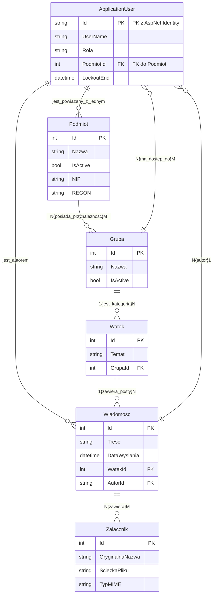

# 📂 Struktura Projektu: Komunikator UKNF (Backend)

## 🌳 Katalog główny (backend)

* **Controllers/** (Kontrolery API - logika biznesowa i routing)
    * `AdminController.cs` (Zarządzanie użytkownikami, grupami, podmiotami. Wymaga roli AdminUKNF.Skrzynka Odbiorcza dla Adminów)
    * `AttachmentsController.cs` (Obsługa przesyłania plików i zapis metadanych.)
    * `AuthController.cs` (Logowanie i generowanie tokenów JWT.)
    * `ThreadsController.cs` (Główna logika komunikacyjna: lista, szczegóły, tworzenie wątków i odpowiedzi.)
    * `MeController.cs` (Zarządzanie danymi i kontekstem zalogowanego użytkownika - np. pobieranie list grup.)
* **Data/** (Warstwa dostępu do danych)
    * `ApplicationDbContext.cs` (Kontekst bazy danych, dziedziczący z IdentityDbContext.)
    * `DataSeeder.cs` (Mechanizm inicjalizacji danych, np. tworzenie konta Admina.)
* **DTOs/** (Data Transfer Objects - modele do komunikacji z API)
    * `AdminThreadDtos.cs`
    * `AssignGrupaToUserDto.cs`
    * `AssignPodmiotRequestDto.cs`
    * `AttachmentDto.cs`
    * `AuthorDto.cs`
    * `AuthResponseDto.cs`
    * `BroadcastMessageDto.cs`
    * `CreateGrupaRequestDto.cs`
    * `CreatePodmiotRequestDto.cs`
    * `CreateThreadDto.cs`
    * `CreateUserRequestDto.cs`
    * `LoginRequestDto.cs`
    * `MessageDto.cs`
    * `ThreadDetailsDto.cs`
    * `ThreadListDto.cs`
    * `UploadAttachmentResponseDto.cs`
    * `EditPodmiotDto.cs`
    * `EditUserDto.cs`
* **Models/** (Modele encji bazy danych)
    * `ApplicationUser.cs` (Rozszerzenie IdentityUser o Role, PodmiotId i Grupy.)
    * `Podmiot.cs`
    * `Grupa.cs`
    * `Watek.cs`
    * `Wiadomosc.cs`
    * `Zalacznik.cs`
    * `RolaUzytkownika.cs` (Enum dla ról: AdminUKNF, MerytorycznyUKNF, Podmiot.)
* **Services/** (Logika biznesowa wyizolowana z kontrolerów, np. usługi wątków)
    * `ThreadService.cs` (Zawiera logikę obsługi załączników i odpowiedzi na Broadcast.)
* **Properties/**
    * `launchSettings.json` (Ustawienia uruchamiania aplikacji.)
* **uploads/** (Katalog generowany w czasie działania, do przechowywania fizycznych załączników)
    * `[pliki załączników...]`
* `appsettings.json` (Główne ustawienia konfiguracyjne, np. połączenie z DB, klucz JWT.)
* `Program.cs` (Punkt startowy aplikacji, konfiguracja middleware i usług.)
* `backend.csproj` (Plik projektu C# - definiuje zależności i frameworki.)

## 📐 Kluczowe Relacje (N:N)

* `Podmiot` <-> `Grupa`
* `ApplicationUser` (Merytoryczny) <-> `Grupa`
* `Wiadomosc` <-> `Zalacznik`

* # 🗺️ Graficzny Schemat Bazy Danych (ERD)

