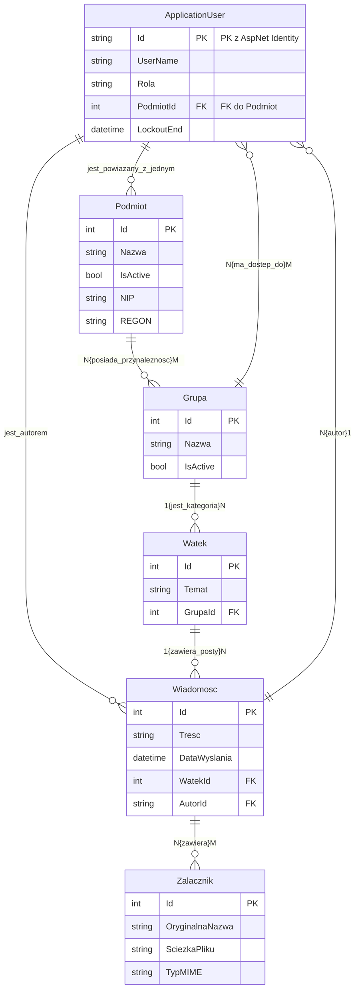

# 📂 Struktura Projektu: Komunikator UKNF (Backend)

## 🌳 Katalog główny (backend)

* **Controllers/** (Kontrolery API - logika biznesowa i routing)
    * `AdminController.cs` (Zarządzanie użytkownikami, grupami, podmiotami. Wymaga roli AdminUKNF.Skrzynka Odbiorcza dla Adminów)
    * `AttachmentsController.cs` (Obsługa przesyłania plików i zapis metadanych.)
    * `AuthController.cs` (Logowanie i generowanie tokenów JWT.)
    * `ThreadsController.cs` (Główna logika komunikacyjna: lista, szczegóły, tworzenie wątków i odpowiedzi.)
    * `MeController.cs` (Zarządzanie danymi i kontekstem zalogowanego użytkownika - np. pobieranie list grup.)
* **Data/** (Warstwa dostępu do danych)
    * `ApplicationDbContext.cs` (Kontekst bazy danych, dziedziczący z IdentityDbContext.)
    * `DataSeeder.cs` (Mechanizm inicjalizacji danych, np. tworzenie konta Admina.)
* **DTOs/** (Data Transfer Objects - modele do komunikacji z API)
    * `AdminThreadDtos.cs`
    * `AssignGrupaToUserDto.cs`
    * `AssignPodmiotRequestDto.cs`
    * `AttachmentDto.cs`
    * `AuthorDto.cs`
    * `AuthResponseDto.cs`
    * `BroadcastMessageDto.cs`
    * `CreateGrupaRequestDto.cs`
    * `CreatePodmiotRequestDto.cs`
    * `CreateThreadDto.cs`
    * `CreateUserRequestDto.cs`
    * `LoginRequestDto.cs`
    * `MessageDto.cs`
    * `ThreadDetailsDto.cs`
    * `ThreadListDto.cs`
    * `UploadAttachmentResponseDto.cs`
    * `EditPodmiotDto.cs`
    * `EditUserDto.cs`
* **Models/** (Modele encji bazy danych)
    * `ApplicationUser.cs` (Rozszerzenie IdentityUser o Role, PodmiotId i Grupy.)
    * `Podmiot.cs`
    * `Grupa.cs`
    * `Watek.cs`
    * `Wiadomosc.cs`
    * `Zalacznik.cs`
    * `RolaUzytkownika.cs` (Enum dla ról: AdminUKNF, MerytorycznyUKNF, Podmiot.)
* **Services/** (Logika biznesowa wyizolowana z kontrolerów, np. usługi wątków)
    * `ThreadService.cs` (Zawiera logikę obsługi załączników i odpowiedzi na Broadcast.)
* **Properties/**
    * `launchSettings.json` (Ustawienia uruchamiania aplikacji.)
* **uploads/** (Katalog generowany w czasie działania, do przechowywania fizycznych załączników)
    * `[pliki załączników...]`
* `appsettings.json` (Główne ustawienia konfiguracyjne, np. połączenie z DB, klucz JWT.)
* `Program.cs` (Punkt startowy aplikacji, konfiguracja middleware i usług.)
* `backend.csproj` (Plik projektu C# - definiuje zależności i frameworki.)

## 📐 Kluczowe Relacje (N:N)

* `Podmiot` <-> `Grupa`
* `ApplicationUser` (Merytoryczny) <-> `Grupa`
* `Wiadomosc` <-> `Zalacznik`

* # 🗺️ Graficzny Schemat Bazy Danych (ERD)

### ⚙️ Zależności Wstrzyknięte (Constructor)

| Serwis | Rola |
| :--- | :--- |
| `ApplicationDbContext` | Dostęp do bazy danych. |
| `UserManager<ApplicationUser>` | Zarządzanie tożsamością użytkowników. |
| **`ThreadService`** | **NOWOŚĆ:** Zawiera logikę biznesową związaną z wątkami (np. tworzenie nowych wątków z odpowiedzi, pobieranie załączników). |

---

### 1. Lista Wątków (`GET /api/threads`)

Logika pobierania listy wątków jest ściśle uzależniona od roli użytkownika.

| Rola Użytkownika | Kryterium Filtrowania | Widziane Wątki |
| :--- | :--- | :--- |
| **Podmiot** | Wątki należące do Grupy, do której Podmiot jest przypisany **ORAZ** wątki, w których użytkownik **brał udział** (`Wiadomosci.Any(m => m.AutorId == user.Id)`). | Własna korespondencja oraz komunikaty grupowe. |
| **Merytoryczny UKNF** | Wątki należące do **Grup, do których Merytoryczny jest przypisany**. | Korespondencja z Podmiotami nadzorowanymi przez niego. |
| **AdminUKNF** | **ZABLOKOWANE (`Forbid`):** Administrator musi używać dedykowanego endpointu `GET /api/Admin/wiadomosci`. |

---

### 2. Szczegóły Wątku (`GET /api/threads/{id}`)

Weryfikacja uprawnień jest wymagana dla wszystkich ról:

* **Autoryzacja Podmiotu:** Użytkownik Podmiotu może zobaczyć wątek, jeśli **należy do Grupy Podmiotu** (jest to Broadcast) **LUB jest autorem wiadomości** w danym wątku.
* **Autoryzacja Merytorycznego:** Użytkownik Merytoryczny może zobaczyć wątek, jeśli **wątek należy do Grupy, do której jest przypisany**.

---

### 3. Odpowiedź na Wątek (`POST /api/threads/{id}/reply`)

Ta metoda zawiera **kluczową logikę biznesową** obsługującą scenariusz "Odpowiedź na Broadcast".

| Użytkownik | Stan Wątku | Akcja Logiczna (Obsługa `ThreadService`) | Zwracany Wynik |
| :--- | :--- | :--- | :--- |
| **Podmiot** | Odpowiada na **Broadcast** (wiadomość wysłaną przez UKNF do grupy). | **Automatyczne utworzenie NOWEGO wątku** między Podmiotem a UKNF. | Nowy `watekId`. |
| **Podmiot/Merytoryczny** | Odpowiada na **istniejący wątek konwersacyjny** (nie-Broadcast). | Standardowe dodanie wiadomości do istniejącego wątku. | Istniejący `watekId`. |

---

### 4. Tworzenie Wątku i Broadcast

| Metoda | Ścieżka | Uprawnienia | Opis |
| :--- | :--- | :--- | :--- |
| **`POST`** | `/api/threads/create` | `[Authorize(Roles = "Podmiot")]` | Użytkownik Podmiotu może stworzyć nowy wątek, pod warunkiem, że jest przypisany do Grupy docelowej. |
| **`POST`** | `/api/threads/broadcast` | `[Authorize(Roles = "MerytorycznyUKNF")]` | Użytkownik Merytoryczny może stworzyć **jednostronny komunikat (Broadcast)**, który trafi do wszystkich Podmiotów w Grupie docelowej. |
